# SPRINGBOOT REST API

## Swagger UI for API Specification

Below URL can be used to access Swagger UI when the spring-boot application is run locally. 
> [Localhost Swagger UI](http://localhost:9090/api/swagger-ui.html)

## API Build & deploy from `GIT` repository
Below section would cover tasks required to configure and deploy api jar

1. Clone repo on local system. By default, jars would be taken from Maven Central Repository
2. Build the project using Maven command `mvn clean install`

## Configure application.properties
Below section describes how to configure application.properties file to override the default values.  

- Spring Boot Server Port
    > `server.port`= 9090

- Spring Boot Application name
    > `spring.application.name`= ms-employee-service

- Spring Boot Application Context path
    > `spring.servlet.context-path`= /api
  
## Images Screen shot

Add New Emmployee

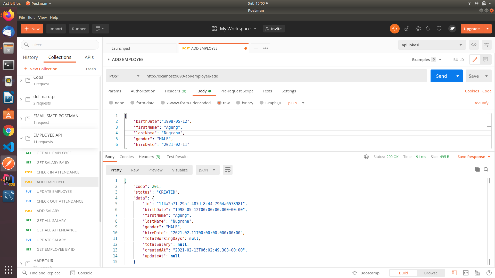

Update Employee

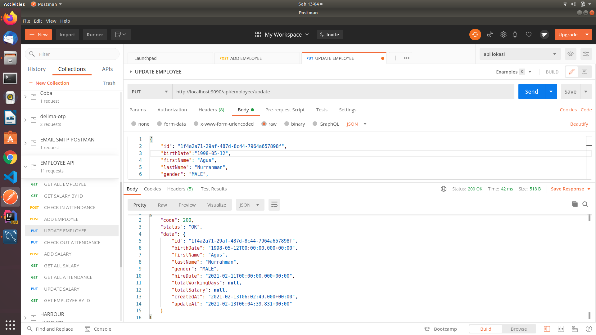

List All Employee

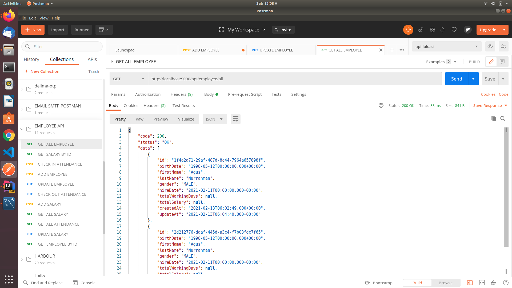

Get Employee by ID

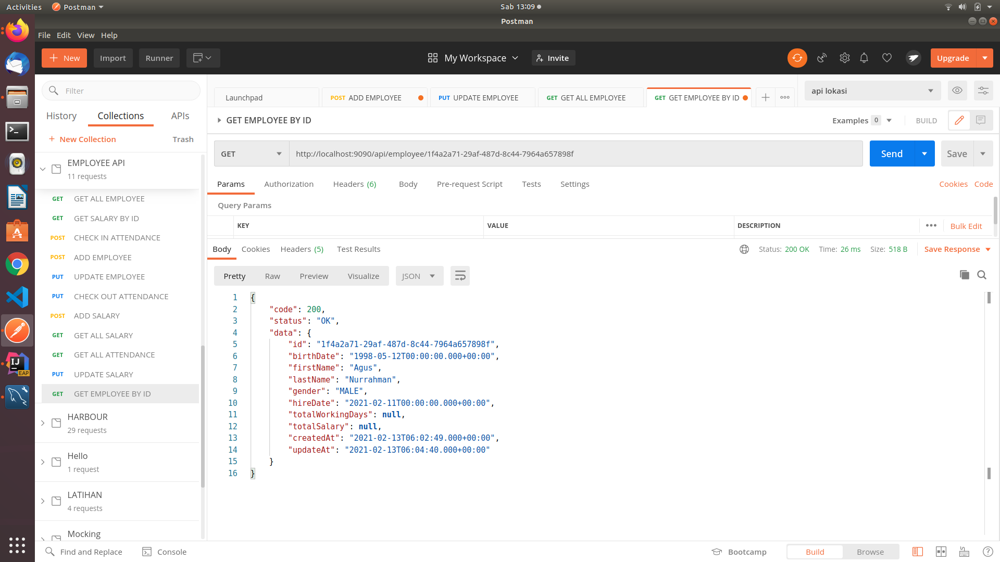

Delete Employee

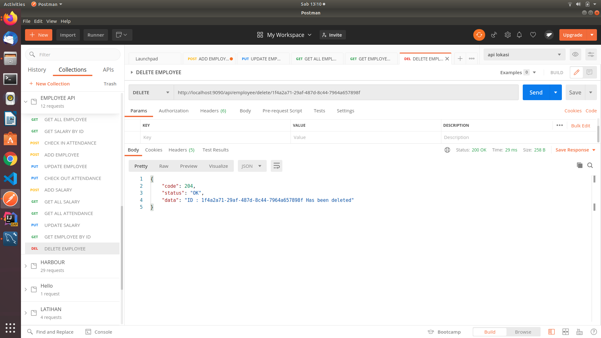

Add New Salary

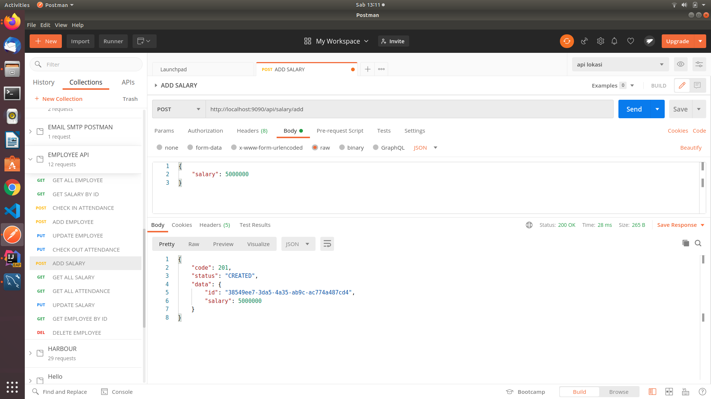

Update Salary

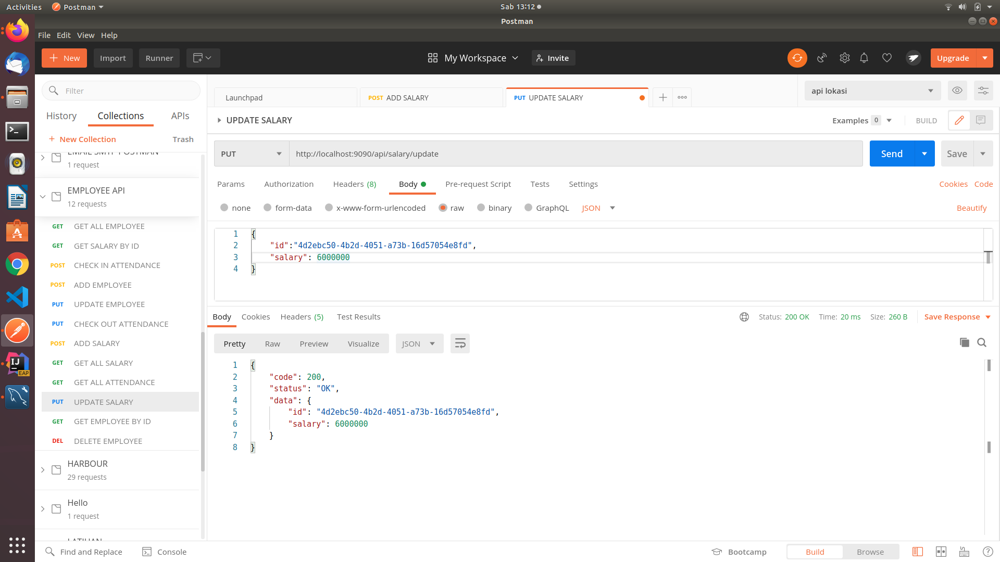

List All Salary

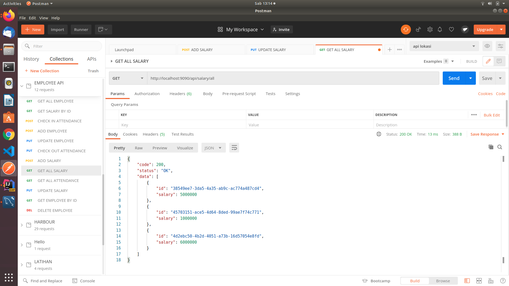

Get Salary by ID

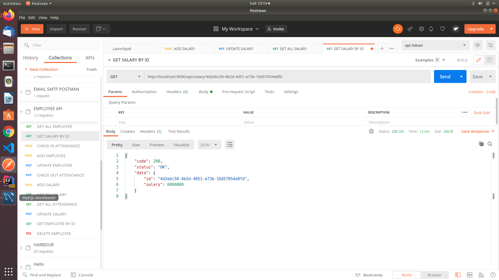

Delete Salary

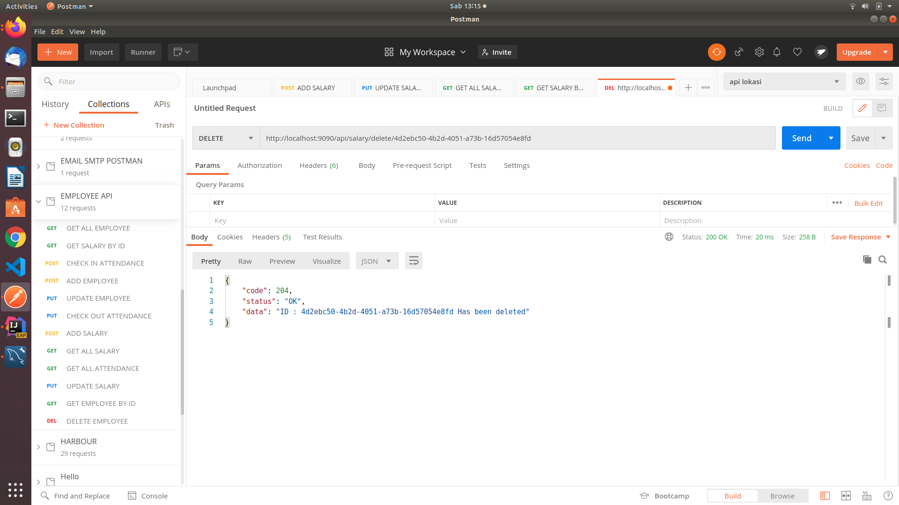

Check In

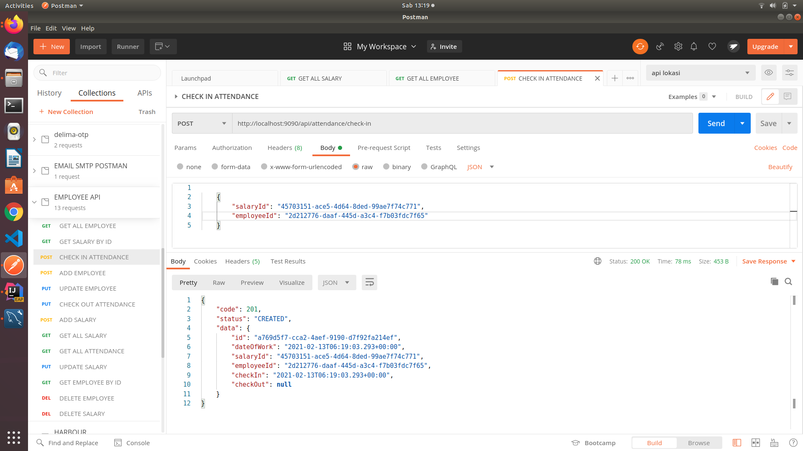

Check Out

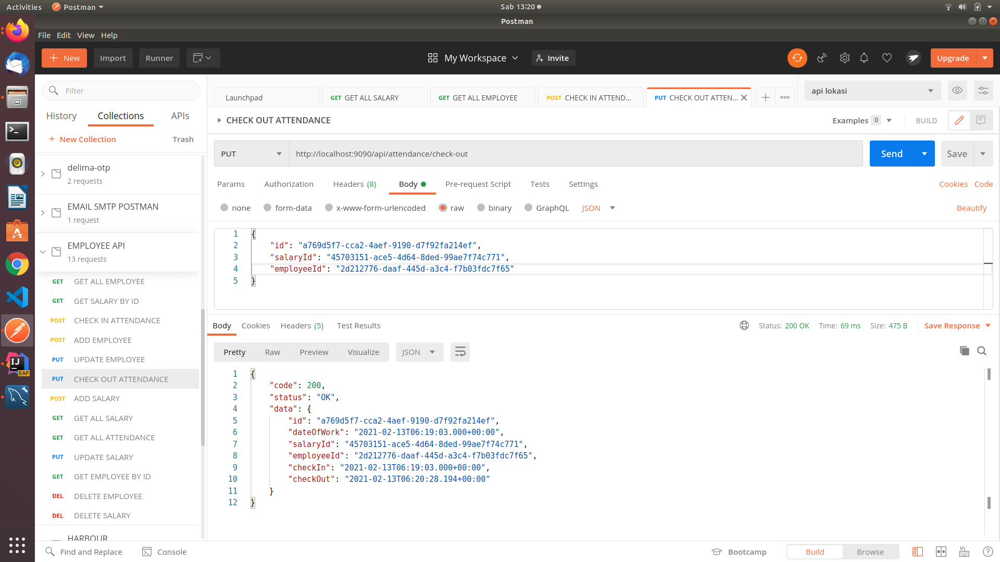

List All Attendance

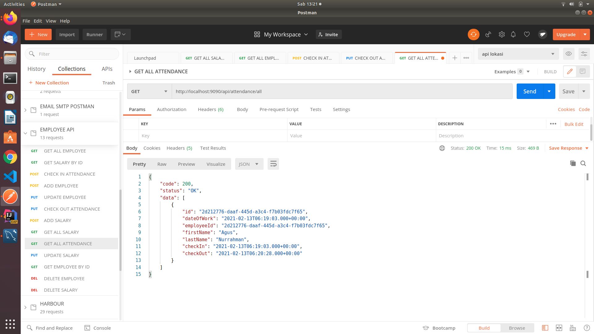

Delete Attendance

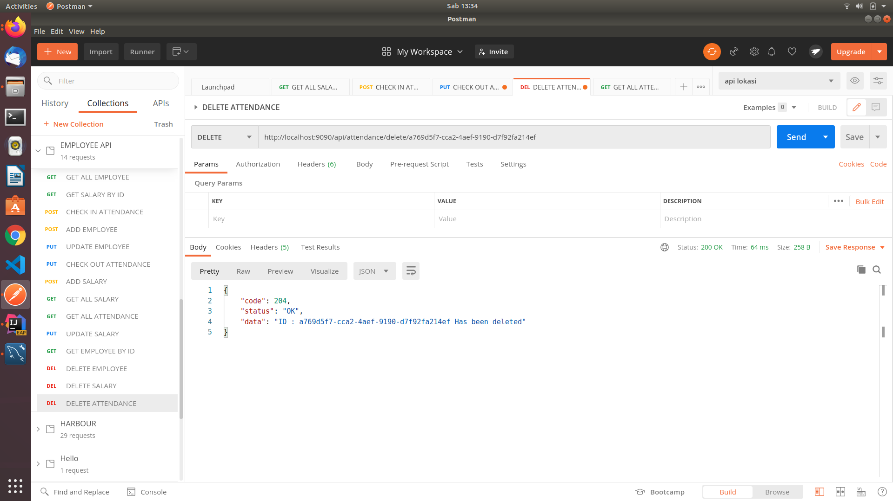

Get Employee After Check Out Attendance

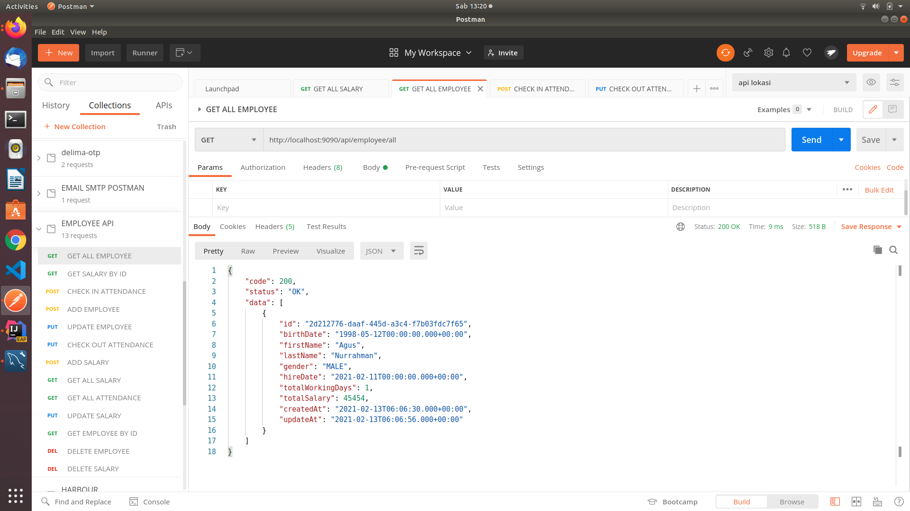
